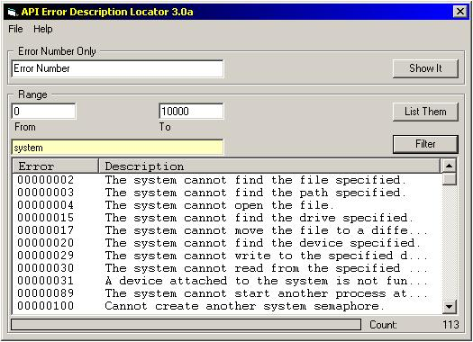



## A Better API Error Lookup

### Description

Queries Windows for the meaning of an API error number, and allows you to search a range of numbers... the results get placed in a list
 
### More Info
 
The only place this is useful is for grabbing the definition of those cryptic API error number. The other route is to look them up on MSDN... this is easier.

While it will return most API error messages, there are some (such as error 34) which won't... for somereason, FormatMessage API returns an exception, so there is code in VB to trap Exceptions but as a side effect, the error codes which return the exception are not displayed

             |
---                |---
**Submitted On**   |2000-08-07 11:15:22
**By**             |[Shawn Bullock](https://github.com/Planet-Source-Code/PSCIndex/blob/master/ByAuthor/shawn-bullock.md)
**Level**          |Intermediate
**User Rating**    |4.3 (30 globes from 7 users)
**Compatibility**  |VB 5\.0, VB 6\.0
**Category**       |[Windows API Call/ Explanation](https://github.com/Planet-Source-Code/PSCIndex/blob/master/ByCategory/windows-api-call-explanation__1-39.md)
**World**          |[Visual Basic](https://github.com/Planet-Source-Code/PSCIndex/blob/master/ByWorld/visual-basic.md)
**Archive File**   |[CODE\_UPLOAD8705872000\.zip](https://github.com/Planet-Source-Code/shawn-bullock-a-better-api-error-lookup__1-10481/archive/master.zip)

